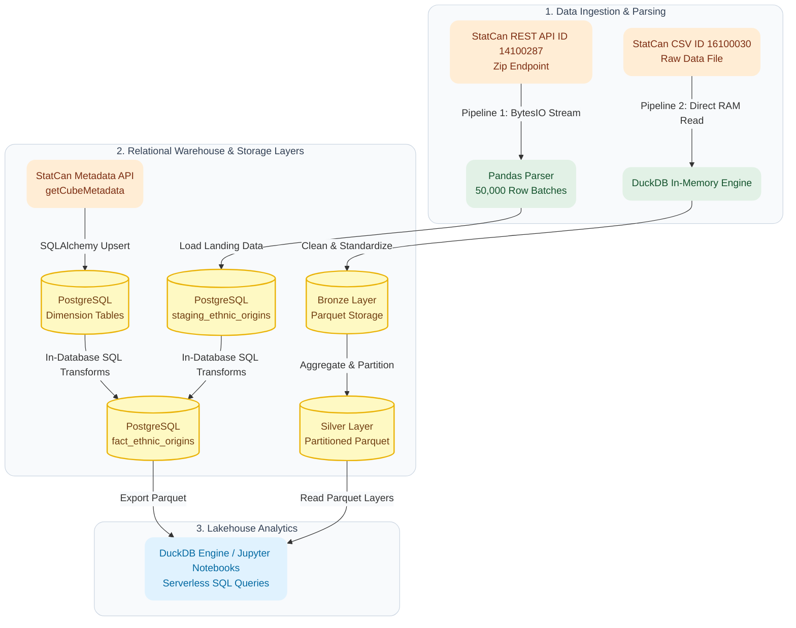
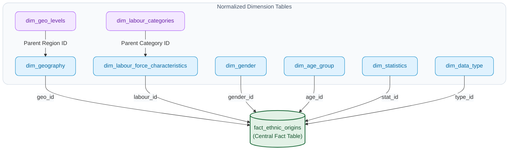

# StatCan Data Lakehouse & ELT Pipelines

A data engineering project exploring two pipeline patterns for processing Statistics Canada census datasets: API streaming with Pandas into PostgreSQL, and direct CSV parsing with DuckDB into partitioned Bronze/Silver Parquet layers.

---

## Technical Stack

* **Languages:** Python 3.13, SQL
* **Relational Database:** PostgreSQL 15+ (Staging Warehouse & Snowflake Schema)
* **Analytical Engine:** DuckDB (In-memory CSV parsing, Parquet export, and SQL-on-Parquet queries)
* **Data Libraries & Tools:** Pandas, SQLAlchemy, `requests`, Jupyter Notebook
* **Environment:** Docker, WSL 2 (Ubuntu Linux)

---

## Project Overview

This project explores two pipeline workflows using national demographic and economic census datasets from Statistics Canada:

* **Pipeline 1 (StatCan ID 14100287 - API Ingestion & Pandas):** Streams zip archives from the StatCan REST API, parses records in 50,000-row Pandas batches into a PostgreSQL Snowflake Schema, and exports Parquet files for DuckDB querying.
* **Pipeline 2 (StatCan ID 16100030 - Direct CSV & DuckDB Lakehouse):** Uses DuckDB's in-memory engine to parse raw CSV files directly in RAM, writing cleaned tables directly into Bronze and Silver Parquet directory layers for partitioned lakehouse querying.

Both pipelines are built to mirror an **AWS Cloud Data Lakehouse** setup (Amazon Redshift, S3, and Amazon Athena) by managing structured relational schemas in PostgreSQL and running serverless SQL queries on compressed Parquet files using DuckDB and Jupyter Notebooks.

---

## Pipeline Architecture

---

## Pipeline Implementation Details

* **Pipeline 1 Ingestion (`requests`, `io.BytesIO`, `Pandas`):** Streams Product ID 14100287 zip files directly into RAM memory to avoid writing temp files to disk. Parses the raw CSV in 50,000-row batches, converts column names to `snake_case`, and appends them into PostgreSQL staging.
* **Pipeline 2 Ingestion (`DuckDB`):** Uses DuckDB's native vectorized CSV reader to parse Product ID 16100030 raw files directly in memory, bypassing Pandas chunking and relational staging entirely.
* **Automatic Dimension Setup (`SQLAlchemy`):** Fetches dimension categories from StatCan's REST API (`getCubeMetadata`) and inserts them into 6 dimension tables while ignoring duplicates (`ON CONFLICT DO UPDATE`).
* **Database Transformations (`SQL`):** Uses SQL queries inside PostgreSQL to link raw text rows to dimension IDs, populating a central fact table.
* **Bronze & Silver Lakehouse Storage (`DuckDB`):** Pipeline 2 structures exported data into dedicated Bronze (cleaned Parquet) and Silver (partitioned analytical) folders, mimicking data lakehouse storage layouts like Apache Iceberg on Amazon S3.
* **SQL Querying (`DuckDB`, `Jupyter Notebook`):** Both pipelines support running fast SQL queries over compressed Parquet files using DuckDB inside Jupyter Notebooks, providing a local alternative to Amazon Athena or Redshift Spectrum.

---

## Data Model (Snowflake Schema)

The database organizes dimensional relationships into a Snowflake Schema, breaking down complex categories (such as sub-regions or employment sub-types) into smaller sub-tables before connecting them to the central fact table.

### Table Structure

* **`staging_ethnic_origins`:** The raw landing table where imported CSV text first arrives.
* **`fact_ethnic_origins`:** The central fact table holding numerical counts, rates, and values linked to dimension IDs.
* **`dim_geography` & `dim_geo_levels`:** Maps locations from national down to provinces and sub-regions.
* **`dim_labour_force_characteristics` & `dim_labour_categories`:** Maps employment categories and job classifications.
* **`dim_gender`:** Gender and sex demographic classifications.
* **`dim_age_group`:** Age range brackets.
* **`dim_statistics`:** Tells you the measure type (count, percentage, rate).
* **`dim_data_type`:** Quality flags and unit descriptors.
