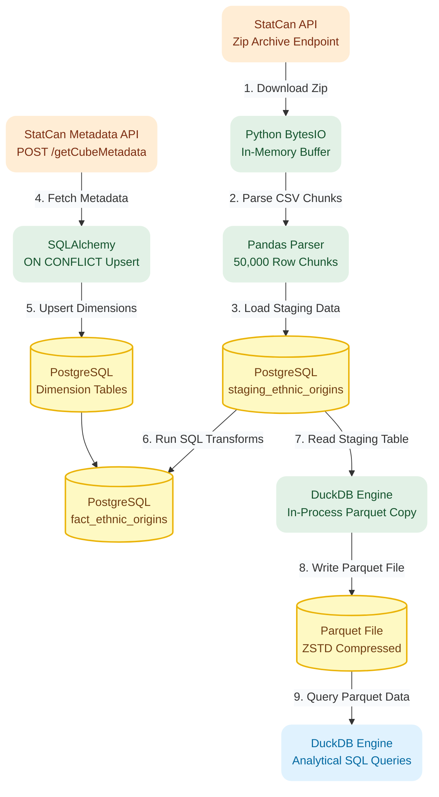
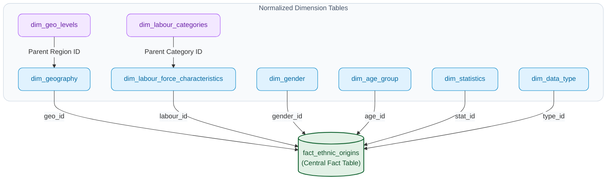

# StatCan Data Lakehouse ELT Pipeline

A local data engineering pipeline that cleans Statistics Canada census data, stores it in a PostgreSQL Snowflake Schema, and converts it to compressed Parquet files for fast SQL queries in DuckDB. This architecture mimics how Amazon Redshift, S3, and Amazon Athena work together in the cloud.

---

## Technical Stack

* **Languages:** Python 3.13, SQL
* **Relational Database:** PostgreSQL 15+ (Staging Warehouse & Snowflake Schema)
* **Analytical Engine:** DuckDB (Fast SQL queries directly on Parquet files)
* **Data Libraries:** Pandas, SQLAlchemy, `requests`
* **Environment:** Docker, WSL 2 (Ubuntu Linux)

---

## Project Overview

This project builds a complete data pipeline using national demographic and economic census data from Statistics Canada (Product ID 14100287). 

While it runs locally on a laptop, it is built to mirror an **AWS Cloud Data Lakehouse** setup:
* **PostgreSQL** Serves as the central analytical warehouse, modeling the dimensional data structure of **Amazon Redshift**.
* **DuckDB** Runs SQL queries directly on local Parquet files, mimicking serverless **Amazon Athena** (or **Redshift Spectrum**) queries over S3 storage.

---

## Pipeline Architecture

---

## Pipeline Implementation Details

* **In-Memory Downloading (`requests`, `io.BytesIO`):** Downloads large `.zip` files straight into RAM memory so the code runs fast without saving extra temp files to your hard drive.
* **Chunked Ingestion (`Pandas`):** Reads the giant CSV file in 50,000-row batches, fixes column names into clean lowercase format (`snake_case`), and loads them into PostgreSQL without crashing memory.
* **Automatic Dimension Setup (`SQLAlchemy`):** Calls StatCan's REST API (`getCubeMetadata`) to fetch categories (like regions, age groups, and job types), inserting them into 6 dimension tables while ignoring duplicates (`ON CONFLICT DO UPDATE`).
* **Database Transformations (`SQL`):** Uses SQL queries inside PostgreSQL to link raw text rows to their respective dimension IDs, creating a clean central fact table.
* **Parquet Export & Querying (`DuckDB`):** Uses a standalone script (`duckdb_test.py`) with DuckDB to convert raw tables into small, compressed Parquet files (`.parquet`), allowing instant SQL queries over local files just like Amazon Athena does in S3.

---

## Data Model (Snowflake Schema)

The database organizes data into a Snowflake Schema, breaking down complex categories (like sub-regions or job sub-types) into smaller, neat sub-tables before connecting them to the main numbers table.

### Table Structure

* **`staging_ethnic_origins`:** The raw landing table where imported CSV text first arrives.
* **`fact_ethnic_origins`:** The main table holding all numerical counts, rates, and values, linked to dimension IDs.
* **`dim_geography` & `dim_geo_levels`:** Maps locations from country down to provinces and sub-regions.
* **`dim_labour_force_characteristics` & `dim_labour_categories`:** Maps employment categories and job classifications.
* **`dim_gender`:** Gender and sex breakdowns.
* **`dim_age_group`:** Age bracket ranges.
* **`dim_statistics`:** Tells you what type of number it is (count, percentage, rate).
* **`dim_data_type`:** Quality flags and unit descriptors.
